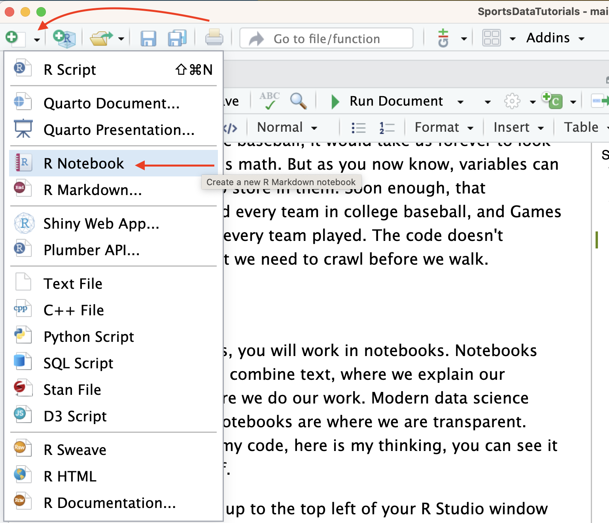
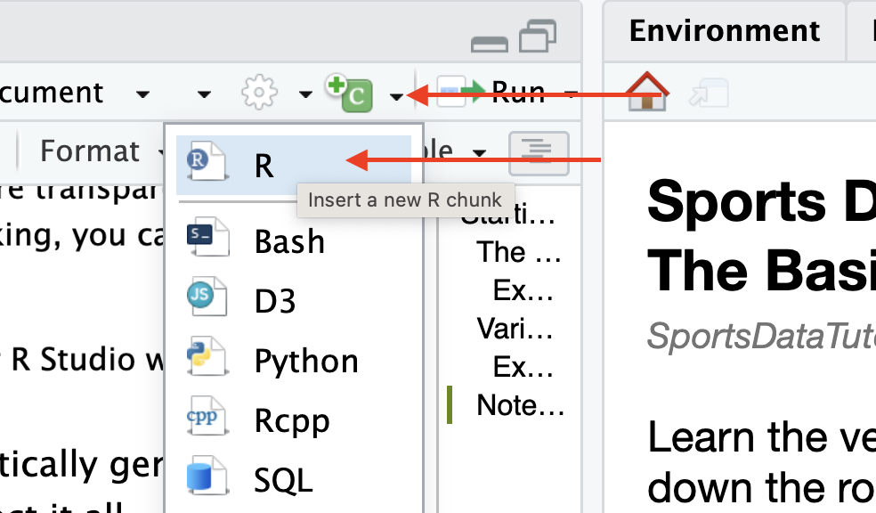

```{r setup, include=FALSE}
library(learnr)
library(gradethis)
library(tidyverse)
library(glue)
knitr::opts_chunk$set(echo = FALSE)
tutorial_options(exercise.completion=FALSE)
```

```{r load-data, message=FALSE, warning=FALSE}
g <- 57
hr <- 97
hpg <- 97/57
```

# Starting out

## The basics of the basics

R is a programming language, one specifically geared toward statistical analysis. Like all programming languages, it has certain built-in functions and you can interact with it in multiple ways. The first, and most basic, is the console. Think of the console like talking directly to R. It's direct, but it has some drawbacks and some quirks we'll get into later.

For now, we're going to use windows in this page like console windows. You'll type commands into the boxes below and hit the Run Code button on the top right of the box. Be sure that you're reading closely -- things like spaces, capitalization and spelling all matter. Some things matter to the point that if you miss them, the code won't work. Other things are stylistic. It takes time and practice to know the difference.

To be clear: **Everyone makes mistakes**. **Everyone makes dumb mistakes**. Everyone overlooks dumb mistakes for hours only to be shown the missing comma. **You aren't dumb**. You're like every single person who has ever tried to learn how to code.

One of the most difficult hurdles for beginning students of mathematics to get over is notation. If you miss a day, tune out for a class, or just never get around to asking what something means, you'll be lost. So lets just cover some bases and make sure we all understand some ultra-basic notation.

You might laugh at these, but someone reading them is looking up Gods on Wikipedia to thank. So do yourself a favor and refresh.

| Symbol | Meaning        | Example |
|--------|----------------|---------|
| \+     | addition       | 5+2     |
| \-     | subtraction    | 6-2     |
| \*     | multiplication | 7\*2    |
| /      | division       | 8/2     |
| \^     | exponent       | 2\^3    |
| sqrt   | square root    | sqrt(4) |

One of the most important and often overlooked concepts in basic math is the order that you do the calculations. When you have something like `5+5*5^2`, which gets done first?

In math, and in code, order matters. If you must do A before you do B, then A needs to appear before and run before B. So you need to keep track of when things happen.

Thankfully, math teachers have provided us an easy to remember mnemonic that you probably learned in sixth grade and tried to forget until now.

**PEMDAS** -- **P**arenthesis, **E**xponents, **M**ultiplication, **D**ivision, **A**ddition, **S**ubtraction

What that means is when you look at a mathematical formula, you do the calculations in the order PEMDAS tells you. Something in parenthesis? Do that first. Is there an exponent? Do that next. Multiplication or division? It's next and so forth. Knowing PEMDAS will save you from stupid mistakes down the road.

### Exercise 1: Using R like a calculator

*Write the code necessary to add 17 and 34 together.* In this case, it's super simple.

```{r addition, exercise=TRUE, exercise.reveal_solution = FALSE}

```

```{r addition-solution, exercise.reveal_solution = FALSE}
17+34
```

```{r addition-check}
grade_this_code()
```

Congrats, you've run some code. It's not very complex, and you knew the answer before hand (maybe, probably), but you get the idea.

## Variables

So we've learned that we can compute things. We can also store things. **In programming languages, these are called variables**. We can assign things to variables using `<-`. And then we can do things with them. **The `<-` is a called an assignment operator**.

With variables, we can assign names to values. Let's try it.

### Exercise 2: Variables

One of the key concepts of programming that you'll need to learn is that most things are a pattern. You'll see that doing certain things takes the same form each time, and all you're doing is changing small parts of the pattern to fit what you want to do.

Declaring variables is a pattern. The pattern here is `Name Of The Thing <- Value Of The Thing`.

Names can be anything you want them to be, but they have to be one word, and it's better if they have no numbers or symbols in it. So you can create a variable called NebraskaWillWinTheNationalTitleThisSeasonMattRhuleIsGod if you want. But some questions for you: What is that variable going to contain? Is it obvious by the name? And do you want to try and type that again? How about three more times? Yeah, me neither.

> **5 Rules For Naming Variables**<br> 1. One word, no spaces.<br> 2. If you must use a number, it has to be at the end, never at the beginning.<br> 3. No symbols (like ! or ? or \# or anything like it).<br> 4. Keep them short, but never one letter. If your variable is holding the number of touchdowns a team scored, don't call it t.<br> 5. Make them understandable. If your variable is holding the number of touchdowns a teams scored, call it touchdowns. Keep it simple.<br>

The next thing we need to know about are the values. There's a bunch of different kinds of values, but two that we're going to work with the most are **strings** and **numbers**. A string is just text. Your name is a string. Your home address is a string. For the most part, strings aren't hard -- they're anything you wouldn't do math on. So, for example, your phone number is a string, even though it's made up of numbers. If we add your phone number to mine, do we get something meaningful? No. Same with ZIP codes. They're strings.

**To record a string, you put it in quotes.** So `myname <- "Matt"` is how to set the value of the variable myname to Matt.

**To record a number, do *not* use quotes.** So `myage <- 46` is how to set the value of the variable myage to 46.

Where this becomes a problem is where you try to make a string into a number or try to do math with strings.

In the window below, create two variables called Number1 and Number2. Set Number1 to 5 and Number2 to "5" with the quotes. Then try adding Number1 + Number2. What happens?

```{r intentional-error-one, exercise=TRUE}

```

You get an error. `non-numeric argument to binary operator` is a rather computer-ish way of saying you tried to add 5 and Zebra. You can't add those two things together. So when you see that error, the non-numeric part is your hint that you're trying to do math on something that isn't a number. To fix it, just remove the quotes.

Let's do something more real and calculate the number of home runs per game the Nebraska baseball team hit this season. To do this, we need to know the number of home runs the team hit and the number of games they played. Then it's just simple division.

[You can find season stats here](https://static.huskers.com/Baseball/2023/teamcume.htm) at the bottom of the table in a row labeled Totals. The number of games is in the column named GP-GS, which stands for Games Played - Games Started. See why naming things what they are is a rule in this class?

We're going to name the first variable HomeRuns and the second variable Games. **Pay Attention: HomeRuns, not Home Runs. The space will break it.** Set them equal to the numbers you got from the table, then divide HomeRuns by Games.

*Write the code necessary to create the variables and set it to the number of home runs Nebraska hit in the 2023 season and the number of games played.*

```{r variables-one, exercise=TRUE}

```

```{r variables-one-hint}
HomeRuns <- ??
Games <- ??
SOMETHING / SOMETHING
```

```{r variables-one-solution, exercise.reveal_solution = FALSE}
HomeRuns <- 97
Games <- 57
HomeRuns / Games
```

```{r variables-one-check}
grade_this_code()
```

```{r basicsresults, exercise=FALSE, exercise.eval=TRUE, exercise.setup = "load-data", results='asis'}
glue("Looking at our ouput, we can read that as the Huskers hit {format(round(hpg, 1))} home runs per game this past season. So if you watched a game, chances are you were going to see the Good Guys hit at least one bomb, and a good chance you'd see 2. Some days you'd get less, some days you get more, but on average, they hit just about {format(round(hpg, 1))} per game.")
```

This isn't terribly useful just yet. If we wanted to know where the Huskers ranked in college baseball, it would take us forever to look up every team and do this math. But as you now know, variables can hold anything we want to store in them. Soon enough, that HomeRuns value will hold every team in college baseball, and Games will hold the games that every team played. The code doesn't change all that much, but we need to crawl before we walk.

## Notebooks

Outside of these tutorials, you will work in notebooks. Notebooks are a place where we can combine text, where we explain our thinking, with code, where we do our work. Modern data science requires transparency. Notebooks are where we are transparent. Here is my data, here is my code, here is my thinking, you can see it all and judge for yourself.

To make a notebook, go up to the top left of your R Studio window and you'll see a green plus sign. Click that, and go down to R Notebook. Or, you can go to the File menu and go to New File and then to R Notebook.

{width="100%"}

You'll notice, in your notebook, a lot of automatically generated text. We do not want that. So you'll need to select it all - command A on a Mac, control A on Windows - and hit delete. You should have a blank page now.

Text -- explanations -- go between code chunks. So At first, just write a sentence.

Then, you can click the green C in the tool bar and go to R or use the keyboard shortcut to add a chunk: Ctrl + Alt + I on Windows or Command + Option + I on Mac.

{width="100%"}

Then, it's simply a matter of putting things where they need to go.

{width="100%"}

When it's time to turn it in, you just go to File \> Save and give the file a name and save it. When asked, you're turning in the .Rmd file you just saved.
