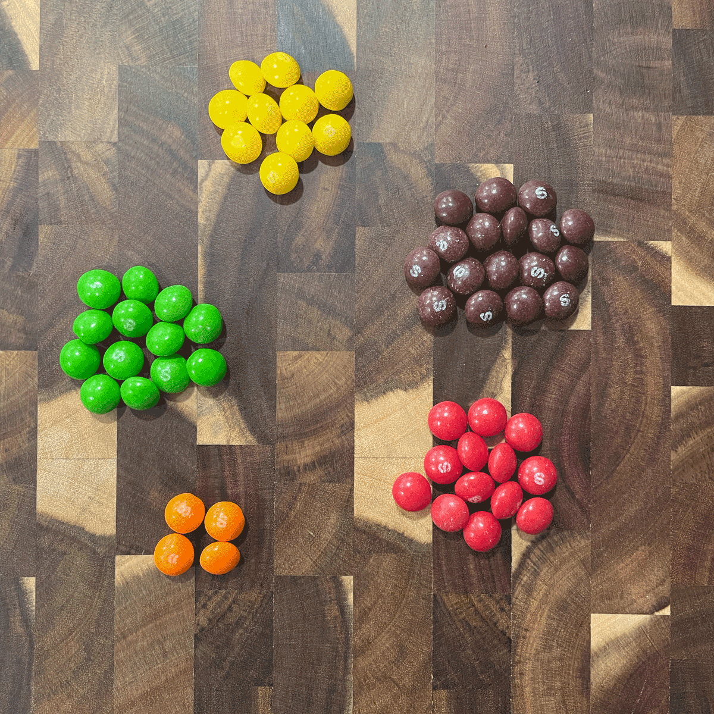

```{r setup, include=FALSE}
library(learnr)
library(gradethis)
library(tidyverse)
library(glue)
knitr::opts_chunk$set(echo = FALSE)
tutorial_options(exercise.completion=FALSE)
```

## The Goal

The goal of this lesson is to introduce you to one of the most fundamental and powerful concepts in data analysis: aggregation. You'll learn how to take large datasets with many individual records and summarize them into meaningful insights. We'll focus on using the group_by() and summarise() functions from the dplyr package to group similar items together and calculate totals. By the end of this lesson, you'll be able to answer questions like "How many players are there in each position?" The examples will use NCAA women's volleyball statistics, but the techniques you learn can be applied to any sport or dataset.

## The Basics

R is a statistical programming language that is purpose built for data analysis.

One of the most basic bits of data analysis is just simply taking a lot of things -- thousands of things -- and putting them together somehow. If you have a dataset of every baseball game played in a season, you can find out how many games a team won by putting them together and counting the Ws. If you have a dataset of every pass thrown in college football you can find out which quarterbacks threw for the most yards *and* which receivers caught the most passes. 

So how do you put things together? 

First, we need to load our libraries. 

Run this.

```{r load-tidyverse, exercise=TRUE}
library(tidyverse)
```

```{r load-tidyverse-solution}
library(tidyverse)
```

```{r load-tidyverse-check}
grade_this_code()
```

Now, let's use the same volleyball player data we used in the last tutorial. 

To load the data, we can run this block of code:

```{r load-data, message=FALSE, warning=FALSE}
volleyballplayers <- read_csv("https://mattwaite.github.io/sportsdatafiles/ncaa_womens_volleyball_playerstats_2023.csv")

nplayers <- nrow(volleyballplayers)

avgsets <- volleyballplayers |>
  group_by(pos) |>
  summarise(
    count = n(),
    mean_sets = mean(s),
    median_sets = median(s)
  ) |>
  arrange(desc(mean_sets)) |> slice(1)

killsleader <- volleyballplayers |> arrange(desc(kills)) |> slice(1)
```

```{r load-data-exercise, exercise = TRUE}
volleyballplayers <- read_csv("https://mattwaite.github.io/sportsdatafiles/ncaa_womens_volleyball_playerstats_2023.csv")
```

```{r load-data-exercise-solution}
volleyballplayers <- read_csv("https://mattwaite.github.io/sportsdatafiles/ncaa_womens_volleyball_playerstats_2023.csv")
```

```{r load-data-exercise-check}
grade_this_code()
```

### Exercise 1: Using head to see your data

Now we can inspect the data we imported. What does it look like? What's in it? What do we have to work with?

To do that, we use `head()` and **put the name of the variable we created above between the parenthesis** to show the headers and **the first six rows of data**.

```{r head-data, exercise=TRUE, exercise.setup = "load-data"}
head(_____)
```

```{r head-data-solution, exercise.reveal_solution = FALSE}
head(volleyballplayers)
```

```{r head-data-check}
grade_this_code()
```

::: {#head-data-hint}
**Hint:** The thing you need is to the left of a \<- in a block above.
:::

Let's look at this. As you can see by the data, we have six players, **which is what we expect** from `head()`. But notice the first row -- the headers. We have things like `team` and `pos` for team and position. And we have a lot of number columns, showing everything from matches started (ms) to kills.

## Answering questions with code

```{r numberplayers, exercise=FALSE, exercise.eval=TRUE, exercise.setup = "load-data", results='asis'}
glue("What if we wanted to know how many players there were by position, i.e. how many outside hitters are there in the NCAA? Or middle blockers? To do that by hand, we'd have to take each of the {nplayers} records and sort them into piles. Liberos over here. Defensive specialists over here. We'd put them in groups and then count them.")
```

`dplyr` has a **group by** function in it that does just this. A massive amount of data analysis involves grouping like things together at some point. So it's a good place to start.

**The secret to writing code is that much of it is a pattern.** The building blocks largely stay the same. With the tidyverse, this is *especially* true.

To accomplish our goal, we start with the name of the data we created before. The same name we used in `head()` and `glipse()`. We'll take that data and we'll introduce a new operator: `|>`. The best way to read that operator, in my opinion, is to interpret that as "and then do this." So the start of our pattern is `data |>` which you can read as `data and now we'll do this`.

The this, in our case, is `group_by()`.

It's important to understand in your mind what `group_by` is doing. It might be easiest to think about it like a package of Skittles. Your data, when you first get it, is like a pack of Skittles -- all mixed up. What `group_by` does is comes along and puts them in little piles. Here's an bag of Skittles dumped out.

{width="100%"}

Now, using `group_by`, we can put them into piles. With Skittles, we group them by color. With sports data, we could do this with teams, players, games, seasons, positions -- the list is endless. But notice -- all of those things are names. They aren't numbers. Rarely ever will you group something by a statistic.

{alt="Grouped data" width="100%"}

Like `head()` and `glimpse()`, **we need to put something in the parenthesis in group_by()**. But unlike `head()` and `glimpse()`, this time the something comes from that **first row of our data**. We are grouping data by one of the pieces of the data -- a field, or column. *If we're trying to group by position*, which field or column in our data looks like it holds the position name? Let's use head again and take a look at the very top row in bold.

<div class="alert alert-info">
  <h4 class="alert-heading">Key Concept</h4>
  <p class="mb-0">A column name -- and only a column name -- can go in <code>group_by</code>.</p>
</div>

To know what we're going to use in `group_by`, we need to take another peek at our data. We'll do this here so we have those column names to refer to in the code blocks coming up. 

```{r head-review, exercise=TRUE, exercise.setup = "load-data"}
head(____)
```

```{r head-review-solution, exercise.reveal_solution = FALSE}
head(volleyballplayers)
```

```{r head-review-check}
grade_this_code()
```

That block of code you just ran has two hints for the code block you'll have to complete later: What data are you using? What field in that data do you want to group by? Keep those in mind.

### Exercise 2: Group by and count

After we group our data together by the thing we want to group it by, we need to count how many things are in each group. We do that first by saying we want to summarize our data (a count is a part of a summary). To get a summary, we have to tell it what we want to summarize. So in this case, we want a count. To get that, let's create a thing called total and set it equal to n(), which is `dplyr`s way of counting something.

Here's the pattern. **You fill in where there are blanks.** What you fill in are the two hints from above.

```{r group-by, exercise=TRUE, exercise.setup = "load-data", message=FALSE}
____ |>
  group_by(____) |>
  summarise(
    total = n()
  ) 
```

```{r group-by-solution, exercise.reveal_solution = FALSE}
volleyballplayers |>
  group_by(pos) |>
  summarise(
    total = n()
  ) 
```

```{r group-by-check}
grade_this_code()
```

::: {#group-by-hint}
**Hint:** The name of your data -- the first thing you need -- is the same as what you used in `head()` and `glimpse()`. Then, look carefully at the first row of the output of head. What you need is in bold at the top. It's a column name.
:::

In this case, we wanted to group together positions, signified by the field name `pos`. After we group the data, we need to count them up. In dplyr, we use `summarize` [which can do more than just count things](https://dplyr.tidyverse.org/reference/summarise.html). Inside the parentheses in summarize, we set up the summaries we want. In this case, we just want a count of the positions: `total = n(),` says create a new field, called `total` and set it equal to `n()`, which might look weird, but it's common in stats. The number of things in a dataset? Statisticians call in n. There are n number of players in this dataset. So `n()` is a function that counts the number of things there are.

### Exercise 3: Arranging data

And when we run that, we get a list of positions with a count next to them. But it's not in any order. So we'll add another And Then Do This %\>% and use `arrange`. Arrange does what you think it does -- it arranges data in order. By default, it's in ascending order -- smallest to largest. But if we want to know the position with the most players, we need to sort it in descending order. In arrange, we need to tell it what we are arranging by. **If you have group_by, then whatever you are arranging by will *always* come from inside summarize.** The pattern looks like this:

```{r group-by-2, exercise=TRUE, exercise.setup = "load-data", message=FALSE}
volleyballplayers |>
  group_by(____) |>
  summarise(
    total = n()
  ) |> 
  arrange(desc(____))
```

```{r group-by-2-solution, exercise.reveal_solution = FALSE}
volleyballplayers |>
  group_by(pos) |>
  summarise(
    total = n()
  ) |> 
  arrange(desc(total))
```

```{r group-by-2-check}
grade_this_code()
```

::: {#group-by-2-hint}
**Hint:** The only thing new here is the arrange, and what goes in arrange comes from summarize, and it isn't the n() parts.
:::

What is the most common position in volleyball? If you look at the row with the largest total, you get your answer.

### Exercise 4: Grouping by more than one thing

We can, if we want, group by more than one thing. Which team has the most of a single position? To do that, we can group by the team and position in the data:

```{r group-by-3, exercise=TRUE, exercise.setup = "load-data", message=FALSE}
volleyballplayers |>
  group_by(____, ____) |>
  summarise(
    total = n()
  ) |> 
  arrange(desc(____))
```

```{r group-by-3-solution, exercise.reveal_solution = FALSE}
volleyballplayers |>
  group_by(team, pos) |>
  summarise(
    total = n()
  ) |> 
  arrange(desc(total))
```

```{r group-by-3-check}
grade_this_code()
```

::: {#group-by-3-hint}
**Hint:** If you're reading this, you're going too fast. I told you what to put in group_by in the sentence above this code window. I will do that a lot this semester. Get used to reading carefully. Hints are EVERYWHERE.
:::

You can learn a bit about how teams are assembled by looking at these simple counts.

## The Recap

In this lesson, we've explored the fundamental process of data aggregation using R and the Tidyverse. We learned how to use group_by() to organize our data into meaningful categories, such as player positions or teams. We then used summarise() to calculate various statistics for these groups, starting with counts. We also practiced arranging our results to highlight the most significant findings. 

The most important bit to remember is that analyzing data in the Tidyverse is a pattern. That pattern goes `data |> function |> function |> function |> output`. Or, put another way:

```
[Input Data] 
       |
       v
[group_by()]  ---> [Groups data by specified variable(s)]
       |
       v
[summarise()] ---> [Calculates summary statistics for each group]
       |
       v
[arrange()]   ---> [Orders the results]
       |
       v
[Output Data]
```

Remember, the power of this approach lies in its flexibility and scalability - the same basic pattern of grouping, summarizing, and arranging can be applied to datasets of any size and complexity. Whether you're analyzing a single volleyball season or decades of multi-sport data, these tools form the foundation of sports data analysis.

## Terms to Know

- **Aggregation**: The process of combining multiple data points into a single summary statistic or result.
- **group_by()**: A function in dplyr that separates data into groups based on one or more variables, allowing for subsequent operations to be performed on each group independently.
- **summarise()** (or summarize()): A function that computes summary statistics for a dataset, often used after group_by() to calculate results for each group.
- **arrange()**: A function used to order rows in a dataset based on values in specified columns, either in ascending (default) or descending order.
- **desc()**: A function used within arrange() to specify descending order for sorting.
- **n()**: A function used within summarise() to count the number of rows in each group.
- **Pipe operator** (|>): A symbol used in R to chain together multiple operations, allowing you to read code from left to right and top to bottom.