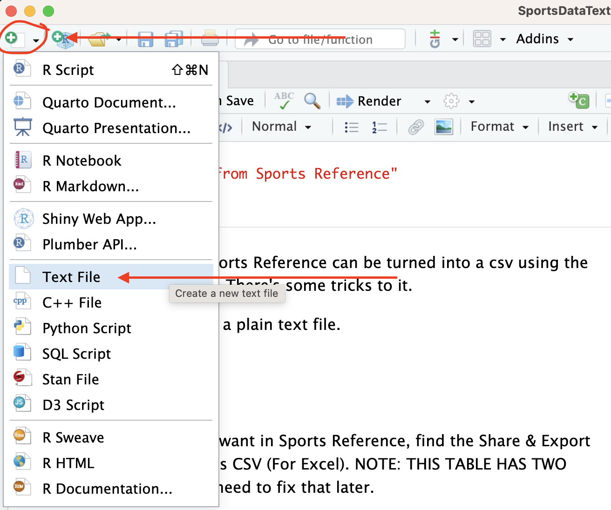
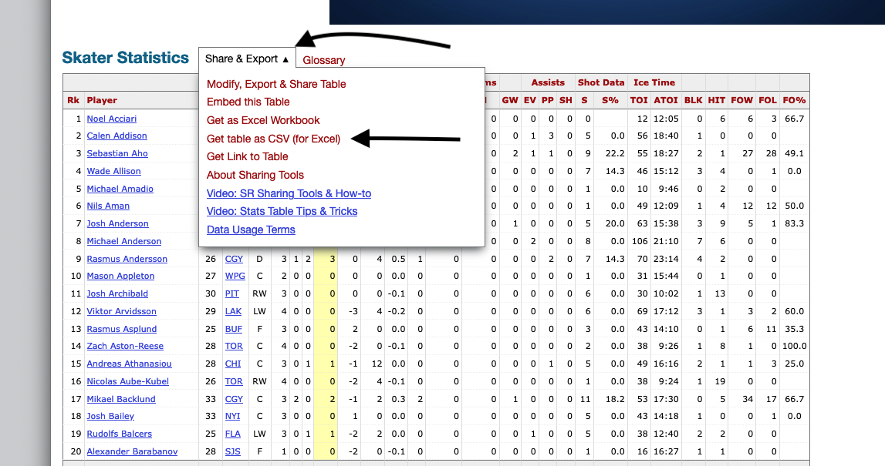
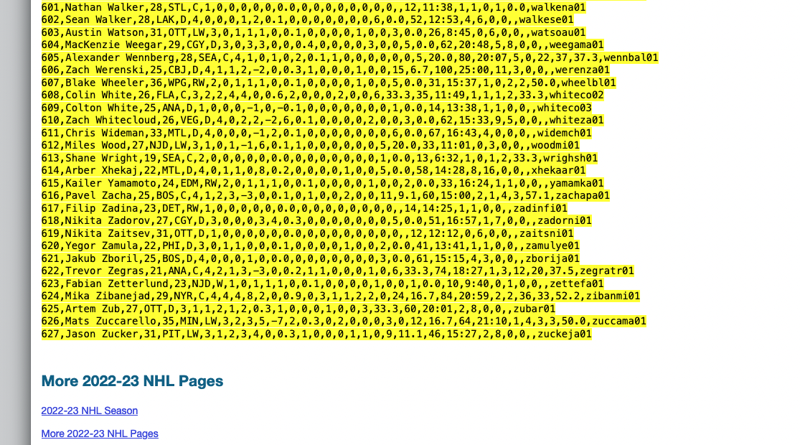
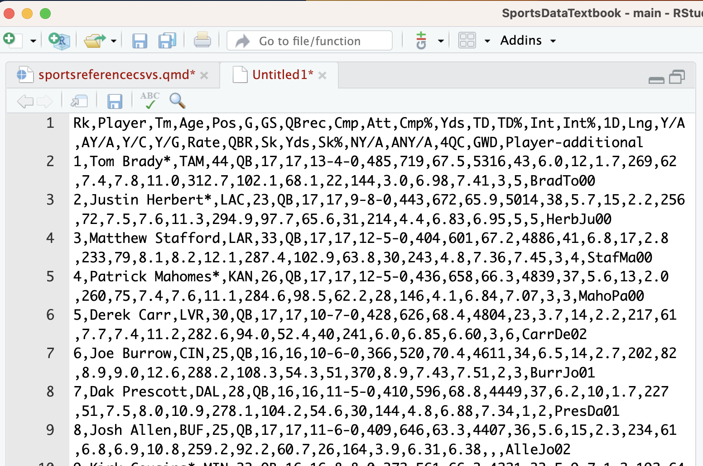
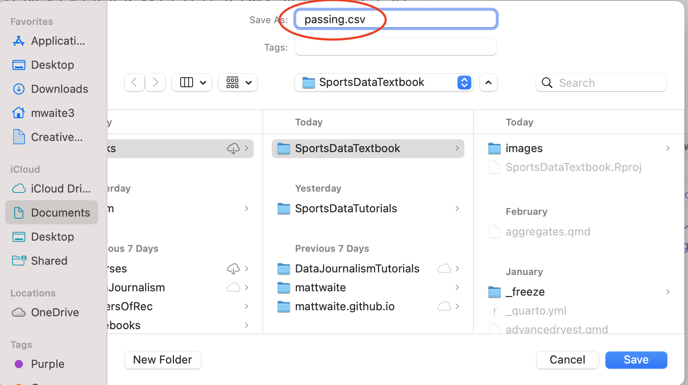

```{r setup, include=FALSE}
library(learnr)
library(gradethis)
knitr::opts_chunk$set(echo = FALSE)
tutorial_options(exercise.completion=FALSE)
```

## The Goal

The goal of this lesson is to teach you how to get data from Sports Reference sites (Sports-Reference.com, Basketball-Reference.com, Baseball-Reference.com, Pro-Football-Reference.com, etc.) into R. Every table on Sports Reference can be turned into a CSV using a copy-and-paste workflow. By the end of this tutorial, you'll know the step-by-step process for exporting table data, cleaning it up in a text file, saving it as a CSV, and importing it into R for analysis.

## Why Sports Reference?

Sports Reference is one of the richest free sources of historical sports statistics on the internet. It covers the NFL, NBA, MLB, NHL, college football, college basketball, and more, going back decades. The catch: the data lives on a website, not in a pre-packaged R dataset.

Fortunately, Sports Reference makes it easy to extract any table as comma-separated text. Once you know the workflow, you can turn virtually any table on the site into a CSV file in minutes.

## Step 1: Open a Plain Text File in RStudio

Before you do anything on the Sports Reference website, open a plain text file in RStudio. You'll use this as a temporary clipboard for the raw CSV text.

In RStudio, go to **File > New File > Text File**. This opens a blank file with no formatting — exactly what you want. A Word document or Google Doc will add invisible characters that corrupt your data.

{width="100%"}

## Step 2: Find Your Table and Open the Export Menu

Navigate to the Sports Reference page that has the table you want. Every data table on Sports Reference has a **Share & Export** button located just above the table (sometimes you need to hover over the table for it to appear).

Click **Share & Export**, then choose **Get table as CSV (for Excel)**. This switches the table display from formatted HTML to raw comma-separated text.

{width="100%"}

**Important note:** Many Sports Reference tables have **two header rows** — one with main column categories and one with sub-categories. You will need to deal with this. More on that in Step 4.

## Step 3: Highlight and Copy the Data

With the table now displayed as CSV text, highlight all of it — from the very first character of the header row down to the last row of data — and copy it (`Cmd+C` on Mac, `Ctrl+C` on Windows).

Make sure you get everything. Missing even one row is easy to do if you're not careful about selecting to the very bottom.

{width="100%"}

## Step 4: Paste Into Your Text File and Fix the Headers

Switch to your plain text file in RStudio and paste the data (`Cmd+V` / `Ctrl+V`).

Now look at your headers carefully. R — and virtually every other data analysis tool — requires **exactly one header row**. If Sports Reference gave you two header rows, you need to fix that now.

Look at the first two rows of your pasted data. The first row will have the main column names. The second row will have sub-category names. Your job is to:

1. Decide which header row to keep (usually a combination: keep row 2 but replace any blank or repeated names with the descriptive name from row 1).
2. Delete the first header row so that row 1 is headers and row 2 is your first data row.

{width="100%"}

Also look for **duplicate column names** within a single row. For example, if a table has both total goals and goals-per-game, both might be labeled `G`. You must rename one of them (e.g., `G` and `G_per_game`) so every column name is unique. R will let you import duplicate column names, but it will auto-rename them in confusing ways, so it's better to fix them now.

## Step 5: Delete Any Repeated Header Rows Inside the Data

Sports Reference sometimes inserts a repeated header row every 20–25 rows within the data itself (it's a web display feature). These look just like the header row but appear in the middle of your data.

Scan through your text file and delete any rows that repeat your column names. They're easy to spot — they'll have the same text as your header row appearing in the middle of the data.

## Step 6: Save as a .csv File

Once your headers are clean and any duplicate header rows are removed, save the file.

In RStudio, go to **File > Save As**. Give your file a meaningful name — something that describes what's in it, like `nebraska_football_2024.csv` — and make sure the filename ends in `.csv`. Save it in the same folder as your R project or in a `data` subfolder within your project.

{width="100%"}

**Do not save it as a `.txt` file.** The `.csv` extension tells R and other tools that the file uses commas to separate values.

## Step 7: Import Into R

Now import your data just like any other CSV file:

```r
library(tidyverse)

your_data <- read_csv("nebraska_football_2024.csv")
```

Replace `your_data` with a descriptive variable name and `nebraska_football_2024.csv` with your actual filename (including the path if it's in a subfolder, e.g., `"data/nebraska_football_2024.csv"`).

If you get errors on import, the most common causes are:

- **Leftover duplicate header rows** in the middle of the data
- **Non-standard characters** in team or player names (common with international athletes)
- **Mismatched column counts** because a row has an extra or missing comma

Use `head()` and `glimpse()` to inspect your imported data and confirm it looks correct before moving on to analysis.

## The Recap

In this lesson, you learned a repeatable workflow for getting data out of Sports Reference and into R:

1. Open a plain text file in RStudio first.
2. Use Sports Reference's **Share & Export > Get table as CSV** option.
3. Highlight and copy all the data.
4. Paste into your text file.
5. Fix headers: keep only one header row, rename any duplicate column names.
6. Delete any repeated header rows that appear inside the data.
7. Save the file with a `.csv` extension.
8. Import with `read_csv()`.

This workflow works for any table on any Sports Reference site. Once you've done it a few times, it takes under two minutes to go from website table to imported R data frame.

## Terms to Know

- **Sports Reference**: A family of websites (Sports-Reference.com, Basketball-Reference.com, Baseball-Reference.com, Pro-Football-Reference.com) providing comprehensive historical sports statistics.
- **CSV (Comma-Separated Values)**: A plain text file format where each value is separated by a comma and each row is on its own line, widely used for storing and transferring tabular data.
- **Share & Export**: The Sports Reference menu option on each data table that allows you to export the table as CSV text.
- **Header row**: The first row of a data file that contains the column names rather than data values. R requires exactly one header row.
- **Duplicate column names**: When two columns in the same dataset share the same name, which R will handle automatically but confusingly — best renamed manually before import.
- **Plain text file**: A file containing only unformatted characters, with no hidden markup or formatting codes — the correct file type to use as a staging area for CSV data.
- **`read_csv()`**: The tidyverse function used to import a CSV file into R as a data frame.
